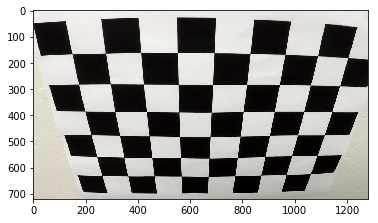
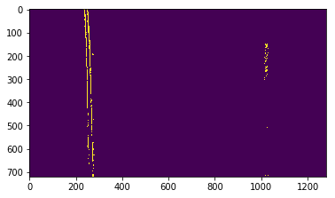
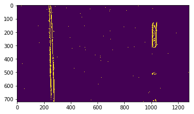
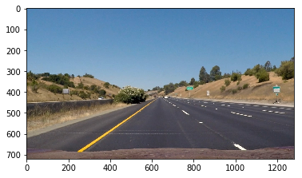
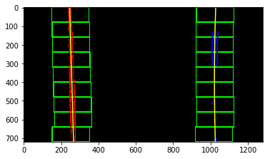

## Writeup 
---

**Advanced Lane Finding Project**

The goals / steps of this project are the following:

* Compute the camera calibration matrix and distortion coefficients given a set of chessboard images.
* Apply a distortion correction to raw images.
* Use color transforms, gradients, etc., to create a thresholded binary image.
* Apply a perspective transform to rectify binary image ("birds-eye view").
* Detect lane pixels and fit to find the lane boundary.
* Determine the curvature of the lane and vehicle position with respect to center.
* Warp the detected lane boundaries back onto the original image.
* Output visual display of the lane boundaries and numerical estimation of lane curvature and vehicle position.

### Writeup / README

#### 1. Provide a Writeup / README that includes all the rubric points and how you addressed each one.  You can submit your writeup as markdown or pdf.  [Here](https://github.com/udacity/CarND-Advanced-Lane-Lines/blob/master/writeup_template.md) is a template writeup for this project you can use as a guide and a starting point.  

All the code is located in the IPython notebook named as ".Advanced Lane Finding.ipynb" 

### Camera Calibration

#### 1. Briefly state how you computed the camera matrix and distortion coefficients. Provide an example of a distortion corrected calibration image.

For this task I created a function "calibrate_camera" which iterates over all the images used to find the chessboard corners. This function gets called before running the pipeline on the video.

I start by preparing "object points", which will be the (x, y, z) coordinates of the chessboard corners in the world. Here I am assuming the chessboard is fixed on the (x, y) plane at z=0, such that the object points are the same for each calibration image.  Thus, `objp` is just a replicated array of coordinates, and `objpoints` will be appended with a copy of it every time I successfully detect all chessboard corners in a test image.  `imgpoints` will be appended with the (x, y) pixel position of each of the corners in the image plane with each successful chessboard detection.  

I then used the output `objpoints` and `imgpoints` to compute the camera calibration and distortion coefficients using the `cv2.calibrateCamera()` function.  I applied this distortion correction using the `cv2.undistort()` function on all the calibration images loaded in the variable 'images_for_calibration = glob.glob('camera_cal/calibration*.jpg')'

### Pipeline (single images)

#### 1. Provide an example of a distortion-corrected image.

This is done in the function "get_perspective_matrix" by using 'mtx' and 'dist' computed in the "calibrate_camera" function
It took long to choose the source points as I choose them manually by trial and error. For this task I've used as source the image in "image_for_perspective_transform = glob.glob('test_images/straight_lines1.jpg')"

Code: 
undistorted_img = cv2.undistort(image, mtx, dist, None, mtx)
cv2.line(undistorted_img, PointOne, PointTwo, color=[255,0,0], thickness = 2)
cv2.line(undistorted_img, PointTwo, PointThree, color=[255,0,0], thickness = 2)
cv2.line(undistorted_img, PointThree, PointFour, color=[255,0,0], thickness = 2)
cv2.line(undistorted_img, PointFour, PointOne, color=[255,0,0], thickness = 2)
#Uncomment the following two lines in the codeto see the results:
#plt.imshow(undistorted_img)
#plt.figure()
#### 2. Describe how (and identify where in your code) you used color transforms, gradients or other methods to create a thresholded binary image.  Provide an example of a binary image result.

I created two functions "threshold" and "compare_threshold". The latter has been used to compare which thresholds had the better results on test images (if it was better to use directional gradient only, or to combine more gradients). I used 4 kinds of gradient which seem to give the best outcome : directional gradient over x axis, gradient magnitude, gradient direction and at last color gradient threshold by using the s channel.

#### 3. Describe how (and identify where in your code) you performed a perspective transform and provide an example of a transformed image.

Actually I've done this before computing the thresholded binary image. For this task I created two functions "get_perspective_matrix" and "warp_image". The first is is called on test_images (doesn't not get called in the pipeline which executes the video). After computing the matrix then "warp_image" is the first function called in the video pipeline.
I verified that my perspective transform was working as expected by drawing the `src` and `dst` points onto a test image and its warped counterpart to verify that the lines appear parallel in the warped image.

#### 4. Describe how (and identify where in your code) you identified lane-line pixels and fit their positions with a polynomial?

I've used the function "detect_lane_pixels". This function chooses whether to compute the lane pixels with the sliding windows method by calling the function "sliding_windows" or "search_around_poly" according to the number of times we have had a bad prediction. If we've reached 3 bad predictions in a row then we go back and use the sliding_windows function. A bad prediction is a prediction where the new curvature changes more than 15% with respect to the median of the good curvatures.

Uncomment the two following lines at line 191-192 to see the output image:
    #plt.figure()
    #plt.imshow(output_img)

#### 5. Describe how (and identify where in your code) you calculated the radius of curvature of the lane and the position of the vehicle with respect to center.

I used the function "measure_curvature_pixels" tuning the variables, ym_per_pix and xm_per_pix according to the size of my Region of Interest.

#### 6. Provide an example image of your result plotted back down onto the road such that the lane area is identified clearly.

The warping and the output is done together in the function draw_lanes. Then to plot statistics on image I've used the function plot_stats_on img.

---

### Pipeline (video)

#### 1. Provide a link to your final video output.  Your pipeline should perform reasonably well on the entire project video (wobbly lines are ok but no catastrophic failures that would cause the car to drive off the road!).

The output video is the file ./project_video_solution.mp4

---

### Discussion

#### 1. Briefly discuss any problems / issues you faced in your implementation of this project.  Where will your pipeline likely fail?  What could you do to make it more robust?

I faced several issues in finding the source and destination points for warping the image. My pipeline would most likely fail when sliding windows would also fail and one way to make it more robust would be to check if the correct computation is good not only on the curvatures vector but also on the fitting coefficients and car offset from centre of the lane.
